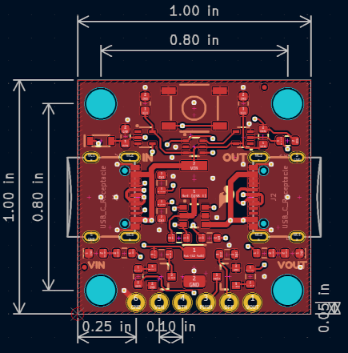

SparkFun Soft Power Switch Mk2 USB-C
===================================================

[*SparkFun Soft Power Switch Mk2 (PRT-27081)*](https://www.sparkfun.com/products/27081)

The Soft Power Switch Mk2 is a passive, hard on/off switch with software feedback and control. In other words, it's like the on/off switch on a laptop. A simple press will turn the system on. Another press can (with MCU intervention) turn off the system. And if things go really wrong, pressing and holding the button for ~7 seconds will force a power-down. If you're building something with an enclosed Thing Plus board and need a good power button, this is the board you need.

The [Mk1 Soft Power Switch](https://www.sparkfun.com/products/17870) is great, but we do see occasional issues caused by component tolerances or the operating temperature. Mk2 is based on an application note by Texas Instruments, and is a completely digital design. It is based around a 74LVC1G175 D-type flip-flop - remember those?! - and is insensitive to temperature and component variation. It also includes improvements like: an over-current self-resetting 2A fuse; input and output LEDs. This version has USB-C connectors, but we also have a version with [JST 2mm](https://www.sparkfun.com/products/25365) battery connectors.

The PUSH pin can act as an output to a microcontroller indicating the state of the power button (high = not pressed, low = user is pressing power button). This can be used as an input to your firmware to begin to shut down before power is lost. PUSH is an open-drain output and requires a pull-up. Alternatively, the OFF pin can be driven **high** by the system forcing fast power off via software. (For Mk1, the Fast Off pin was driven **low**.)

The most common use case is something like this:

* Microcontroller begins running code and checks to see if the power button is still being pressed for X milliseconds.
* If not, it's just a tap, go back to sleep.
* If yes, power up and run normal program.

Later...

* User presses power button in normal program
* If power button is pressed for <X milliseconds, it's just a tap, ignore.
* If power button is pressed for >X milliseconds, it's time to power down.

The wake-up and power-down times can be tweaked for your own user experience but we found 500ms for power up and 2s for power down work really well.

If needed, pads are provided for a larger, external button.

The Soft Power Switch supports battery charging. If the target device has onboard LiPo charging, current can be passed back through the switch circuit and charge the battery.

<b>Heads up!</b> The Mk2 Soft Power Switch works up to 5.5V only. (Mk1 is good up to 12V.)

Pros:

* Very low µA quiescent current
* Hard override power down in case your microcontroller loses its mind
* PUSH and OFF pins can be connected to a microcontroller
* Supports battery charging
* USB data feed-through

Cons:

* Limited to 2A continuous, 4A peak (fuse protected)
* No AC loads

Features
-------------------
* Input voltage: 5V nominal (5.5V maximum, 1.8V minimum)
* Maximum current draw: 2A continuous, 4A peak (fuse protected)
* Very low µA quiescent current
* Hard override: push and hold the button for ~7 seconds
* 1" x 1" PCB
* USB data feed-through
* LEDs: VIN and VOUT (can be disabled if desired)
* Breakouts:
    * GND, VIN, VOUT
    * BTN: if desired, connect an external button between BTN and GND
    * PUSH: open-drain output, requires pull-up, low indicates button is pushed
    * OFF: drive high to turn the output off

Repository Contents
-------------------

* **.github/workflows** - YAML files used for GitHub Actions and GitHub Pages/mkdocs
* **/Examples** - Example sketches demonstrating how to read and control the switch
* **/Hardware** - KiCad design files (kicad_pro, .kicad_pcb, .kicad_sch)
  * **/Production** - Production panel files
* **/docs** - Online documentation files
  * **/assets** - Folder containing all the file assets used for product documentation
    * **/board_files** - Copy of design files used for product documentation
    * **/component_documentation** - Datasheets and manuals for hardware components
    * **/img** - Images for product documentation
  * **/github** - Files stating how to contribute and filing issues used for product documentation
  * **/javascript** - Folder containing custom javascript used for product documentation
  * **/stylesheet** - Folder containing CSS files used for product documentation
* **/overrides** - Customization files used for product documentation
  * **/.icons** - Icons used for GitHub used for product documentation
  * **./partials** - Used for product documentation
* **LICENSE.md** contains the license information

Product Versions
----------------
* [PRT-27081](https://www.sparkfun.com/products/27081) - SparkFun Red Release v2
* [SPX-25366](https://www.sparkfun.com/products/25366) - Original SparkX Release v2
* [SPX-17870](https://www.sparkfun.com/products/17870) - Original SparkX Release v1

Version History
---------------
* v2.0 - Soft Power Switch Mk2 - USB (PRT-27081 and SPX-25366)
* v1.0 - Soft Power Switch Mk1 (JST 2mm) (SPX-17870)

License Information
-------------------

This product is _**open source**_!

Please review the LICENSE.md file for license information.

If you have any questions or concerns on licensing, please contact technical support on our [SparkFun forums](https://forum.sparkfun.com/viewforum.php?f=123).

Distributed as-is; no warranty is given.

- Your friends at SparkFun.
