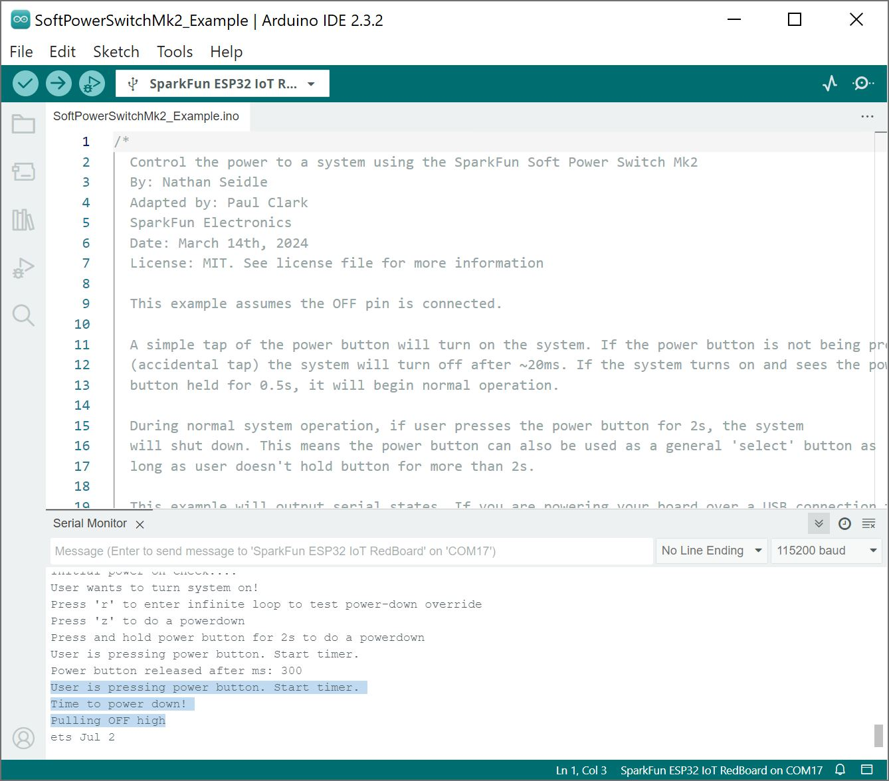

!!! arduino
    This example assumes you are using the latest version of the Arduino IDE on your desktop. If this is your first time using Arduino IDE, library, or board add-on, please review the following tutorials.

    - [Installing the Arduino IDE](https://learn.sparkfun.com/tutorials/installing-arduino-ide)
    - [Installing Board Definitions in the Arduino IDE](https://learn.sparkfun.com/tutorials/installing-board-definitions-in-the-arduino-ide)

!!! note
    If you've never connected an CH340 device to your computer before, you may need to install drivers for the USB-to-serial converter. Check out our section on "[How to Install CH340 Drivers](https://learn.sparkfun.com/tutorials/how-to-install-ch340-drivers)" for help with the installation.

    - [How to Install CH340 Drivers](https://learn.sparkfun.com/tutorials/how-to-install-ch340-drivers/all)

For the scope of this tutorial, we will highlight the example from the GitHub repository to get started. Head to the GitHub repository to download the example  

<div style="text-align: center"><a href="https://github.com/sparkfun/SparkFun_Soft_Power_Switch_USB-C" class="md-button md-button--primary">GitHub Repo > SparkFun_Soft_Power_Switch_USB-C</a></div>


### Upload Arduino Example

After unzipping the compressed files, navigate to the example: ... > **SparkFun_Soft_Power_Switch_USB-C-main** > **Examples** > **SoftPowerSwitchMk2_Example** > **SoftPowerSwitchMk2_Example**.

For users using an Arduino microcontroller, select your board in the Tools menu (in our case the **SparkFun ESP32 RedBoard IoT RedBoard**) and the correct Port it enumerated on.

You can also copy or paste the code as shown below. Then click "Upload".

``` c++
    /*
      Control the power to a system using the SparkFun Soft Power Switch Mk2
      By: Nathan Seidle
      Adapted by: Paul Clark
      SparkFun Electronics
      Date: March 14th, 2024
      License: MIT. See license file for more information

      This example assumes the OFF pin is connected.

      A simple tap of the power button will turn on the system. If the power button is not being pressed
      (accidental tap) the system will turn off after ~20ms. If the system turns on and sees the power
      button held for 0.5s, it will begin normal operation.

      During normal system operation, if user presses the power button for 2s, the system
      will shut down. This means the power button can also be used as a general 'select' button as
      long as user doesn't hold button for more than 2s.

      This example will output serial states. If you are powering your board over a USB connection then
      the power button can't do its job. We did our testing by connecting the TX and GND pins of a RedBoard to
      an external USB to Serial adapter. That way the battery + Soft Power Switch could control power
      to the board.  
    */

    //Hardware connections - GPIO pins (change these as required)
    int _PUSH = 14; // Connect this GPIO to the PUSH breakout pad
    int _OFF = 32; // Connect this GPIO to the OFF breakout pad

    int STAT_LED = LED_BUILTIN;

    unsigned long powerPressedStartTime = 0;

    int debounceDelay = 20;

    //Uncomment the following line to turn on shutdown time measurements
    //#define PRINT_TIMER_OUTPUT

    void setup()
    {
      Serial.begin(115200);
      Serial.println("Soft Power Switch Mk2 example");

      pinMode(_PUSH, INPUT_PULLUP);

      //User has pressed the power button to turn on the system
      //Was it an accidental bump or do they really want to turn on?
      //Let's make sure they continue to press for two seconds
      Serial.print("Initial power on check");
      powerPressedStartTime = millis();
      while (digitalRead(_PUSH) == LOW)
      {
        //Wait for user to stop pressing button.
        //What if user has left something heavy pressing the power button?
        //The soft power switch will automatically turn off the system! Handy.
        delay(100);

        if ((millis() - powerPressedStartTime) > 500)
          break;
        Serial.print(".");
      }
      Serial.println();

      if ((millis() - powerPressedStartTime) < 500)
      {
        Serial.println("Power button tap. Returning to off state. Powering down");
        powerDown();
      }

      Serial.println("User wants to turn system on!");
      powerPressedStartTime = 0; //Reset var to return to normal 'on' state

      //Here we display something to user indicating system is on and running
      //For example an external display or LED turns on
      pinMode(STAT_LED, OUTPUT);
      digitalWrite(STAT_LED, HIGH);

      Serial.println("Press 'r' to enter infinite loop to test power-down override");
      Serial.println("Press 'z' to do a powerdown");
      Serial.println("Press and hold power button for 2s to do a powerdown");

      while (Serial.available()) // Flush the Serial RX buffer
        Serial.read();
    }

    void loop()
    {
      if (Serial.available())
      {
        char incoming = Serial.read();

        if (incoming == 'z')
        {
          Serial.println("Power down");
          powerDown();
        }
        else if (incoming == 'r')
        {
          Serial.println("System locked. Now hold power button to force power down without using software");

          //Here we wait for user press button so we can time it
          while (digitalRead(_PUSH) == HIGH)
            delay(1);

          powerPressedStartTime = millis();
          Serial.println("Doing nothing, waiting for power override to kick in");
          while (1)
          {
    #ifdef PRINT_TIMER_OUTPUT
            Serial.println(millis() - powerPressedStartTime);
    #endif
            delay(1);

            if(digitalRead(_PUSH) == HIGH) break;
          }
          Serial.println("User released button before forced powered could complete. Try again, but hold power button for 7s");
          powerPressedStartTime = 0; //Reset var to return to normal 'on' state
        }
      }

      if (digitalRead(_PUSH) == LOW && powerPressedStartTime == 0)
      {
        //Debounce check
        delay(debounceDelay);
        if (digitalRead(_PUSH) == LOW)
        {
          Serial.println("User is pressing power button. Start timer.");
          powerPressedStartTime = millis();
        }
      }
      else if (digitalRead(_PUSH) == LOW && powerPressedStartTime > 0)
      {
        //Debounce check
        delay(debounceDelay);
        if (digitalRead(_PUSH) == LOW)
        {
          if ((millis() - powerPressedStartTime) > 2000) // Check if button has been held for >= 2 seconds
          {
            Serial.println("Time to power down!");
            powerDown();
          }
        }
      }
      else if (digitalRead(_PUSH) == HIGH && powerPressedStartTime > 0)
      {
        //Debounce check
        delay(debounceDelay);
        if (digitalRead(_PUSH) == HIGH)
        {
          Serial.print("Power button released after ms: ");
          Serial.println(millis() - powerPressedStartTime);
        }
        powerPressedStartTime = 0; //Reset var to return to normal 'on' state
      }
    }

    //Immediately power down
    void powerDown()
    {
      //Indicate to user we are shutting down
      digitalWrite(STAT_LED, LOW);

      Serial.println("Pulling OFF high");
      Serial.flush();

      powerPressedStartTime = millis();

      pinMode(_OFF, OUTPUT);
      digitalWrite(_OFF, HIGH); // Pull OFF high to turn the power off

      while (1)
      {
    #ifdef PRINT_TIMER_OUTPUT
        Serial.println(millis() - powerPressedStartTime);
    #endif
        delay(1);
      }
    }
```

After uploading the code, disconnect the Arduino from your COM port. Then wire a 3.3V Serial Basic Breakout to the Arduino&apos;s serial UART. In this case, we used the SparkFun IoT RedBoard - ESP32 Development Board. Depending on your microcontroller, you may need to adjust the pin connections and definitions with respect to the micrcontroller's UART pins.

<div style="text-align: center;">
    <table>
        <tr>
            <th style="text-align: center; vertical-align: middle; border: solid 1px #cccccc;">3.3V Serial Basic
            </th>
            <th style="text-align: center; vertical-align: middle; border: solid 1px #cccccc;">SparkFun IoT RedBoard<br />- ESP32 Development Board
            </th>
        </tr>
        <tr>
            <td style="text-align: center; border: solid 1px #cccccc;" bgcolor="#d4edda"><font color="#000000">TXO</font>
            </td>
            <td style="text-align: center; border: solid 1px #cccccc;" bgcolor="#d4edda"><font color="#000000">3/RX-0</font>
            </td>
        </tr>

        <tr>
            <td style="text-align: center; border: solid 1px #cccccc;" bgcolor="#ffdaaf"><font color="#000000">RXI</font>
            </td>
            <td style="text-align: center; border: solid 1px #cccccc;" bgcolor="#ffdaaf"><font color="#000000">1/TX-0</font>
            </td>
        </tr>
        <tr>
            <td style="text-align: center; border: solid 1px #cccccc;" bgcolor="#DDDDDD"><font color="#000000">GND</font>
            </td>
            <td style="text-align: center; border: solid 1px #cccccc;" bgcolor="#DDDDDD"><font color="#000000">GND</font>
            </td>
        </tr>
    </table>
</div>

If you have not already, connect the Soft Power Switch Mk2's power, OFF, and PUSH to your Arduino's GPIO pins. In this case, we used the SparkFun IoT RedBoard - ESP32 Development Board. Depending on your microcontroller, you may need to adjust the pin connections and definitions with respect to the microcontroller's GPIO pins.

<div style="text-align: center;">
    <table>
        <tr>
            <th style="text-align: center; vertical-align: middle; border: solid 1px #cccccc;">Soft Power Switch Mk2
            </th>
            <th style="text-align: center; vertical-align: middle; border: solid 1px #cccccc;">SparkFun IoT RedBoard -<br />ESP32 Development Board
            </th>
        </tr>
        <tr>
            <td style="text-align: center; border: solid 1px #cccccc;" bgcolor="#f2dede"><font color="#000000">VOUT</font>
            </td>
            <td style="text-align: center; border: solid 1px #cccccc;" bgcolor="#f2dede"><font color="#000000">5V (or V)</font>
            </td>
        </tr>
        <tr>
            <td style="text-align: center; border: solid 1px #cccccc;" bgcolor="#DDDDDD"><font color="#000000">GND</font>
            </td>
            <td style="text-align: center; border: solid 1px #cccccc;" bgcolor="#DDDDDD"><font color="#000000">GND</font>
            </td>
        </tr>
        <tr>
            <td style="text-align: center; border: solid 1px #cccccc;" bgcolor="#cce5ff"><font color="#000000">OFF</font>
            </td>
            <td style="text-align: center; border: solid 1px #cccccc;" bgcolor="#cce5ff"><font color="#000000"><code>32</code> (or <code>A4</code>)</font>
            </td>
        </tr>
        <tr>
            <td style="text-align: center; border: solid 1px #cccccc;" bgcolor="#d4edda"><font color="#000000">PUSH</font>
            </td>
            <td style="text-align: center; border: solid 1px #cccccc;" bgcolor="#d4edda"><font color="#000000"><code>14</code></font>
            </td>
        </tr>
    </table>
</div>

    insert here


    action shot serial basic breakout connected to Arduino


### Initial Boot

Open the [Serial Monitor](https://learn.sparkfun.com/tutorials/terminal-basics) or terminal emulator of your choice, and connect to the 3.3V Serial Basic Breakout&apos;s COM port with the baud rate set to **115200**. Insert a USB power source into the Soft Power Switch's IN port. Since we are using the ESP32, we will see an initial output when the microcontroller boots up. If the button is not held down for 0.5 seconds, you will receive the following message as shown below.

``` bash
Soft Power Switch Mk2 example
Initial power on check
Power button tap. Returning to off state. Powering down
Pulling OFF high
```

<div style="text-align: center;">
  <table>
    <tr style="vertical-align:middle;">
     <td style="text-align: center; vertical-align: middle; border: solid 1px #cccccc;"><a href="../assets/img/Arduino_Output_Soft_Power_Switch_Serial_Basic_Initial_Boot_No_Button_Press.JPG"></a></td>
    </tr>
    <tr style="vertical-align:middle;">
     <td style="text-align: center; vertical-align: middle; border: solid 1px #cccccc;"><i>Arduino Output Soft Power Switch Mk2 with No Button Press on Startup</i></td>
    </tr>
  </table>
</div>

!!! note
    You may receive a different output when directly connecting the Soft Power Switch to a computer's COM port rather than using a separate 3.3V Serial Basic. When using the Soft Power Switch directly, part of the ESP32 boot up and `Serial.print()` messages may be cut off as the IoT RedBoard - ESP32 is being powered up.


### Normal Operation - Power On

Press down on the button for just over 0.5 seconds (but no longer than 2 seconds) to power your Arduino for normal system operation. Once the ESP32 boots up, you should see the following output. A timer will begin checking the length of time that the button has been pressed down. Once the button has been released, you will receive an output indicating the amount of time that the button has been pressed down after 0.5 seconds.

```bash
Soft Power Switch Mk2 example
Initial power on check....
User wants to turn system on!
Press 'r' to enter infinite loop to test power-down override
Press 'z' to do a powerdown
Press and hold power button for 2s to do a powerdown
User is pressing power button. Start timer.
Power button released after ms: 300
```

<div style="text-align: center;">
  <table>
    <tr style="vertical-align:middle;">
     <td style="text-align: center; vertical-align: middle; border: solid 1px #cccccc;"><a href="../assets/img/Arduino_Output_Soft_Power_Switch_Serial_Basic_Button_Press_Normal_Operation.JPG"></a></td>
    </tr>
    <tr style="vertical-align:middle;">
     <td style="text-align: center; vertical-align: middle; border: solid 1px #cccccc;"><i>Arduino Output Soft Power Switch Mk2 Normal Operation - Power On</i></td>
    </tr>
  </table>
</div>

!!! note
    The wake-up time can be tweaked to your own user experience. We found 500ms for power up work really well.


### Normal Operation - Power Off

Let's try turning the power off under normal operation. Press the power button for 2 seconds to power down the Arduino. You will receive the following output. You will also notice that the power LEDs on the SparkFun IoT RedBoard - ESP32 turn off indicating that there is no power.

``` bash
User is pressing power button. Start timer.
Time to power down!
Pulling OFF high
```

<div style="text-align: center;">
  <table>
    <tr style="vertical-align:middle;">
     <td style="text-align: center; vertical-align: middle; border: solid 1px #cccccc;"><a href="../assets/img/Arduino_Output_Soft_Power_Switch_Serial_Basic_Button_Press_Normal_Operation_Power_Down.JPG"></a></td>
    </tr>
    <tr style="vertical-align:middle;">
     <td style="text-align: center; vertical-align: middle; border: solid 1px #cccccc;"><i>Arduino Output Soft Power Switch Mk2 Normal Operation Power Down</i></td>
    </tr>
  </table>
</div>

!!! note
    The power-down time can be tweaked to your own user experience. We found 2s for power-down work really well. If you decide to adjust the power-down time, make sure to not exceed ~10 seconds as the force power down will take into effect.


### System Lock and Power Down via Arduino Serial Monitor

Remember the output from earlier? There were additional options to control the Soft Power Switch from the Arduino Serial Monitor. Press down on the power button for 0.5 seconds to enter the normal operation again. You will be presented with two options:

* **<kbd>r</kbd>** &mdash; Sending an **r** will cause the Arduino to enter an infinite loop to test power-down override. This will lock the system and force the Soft Power Switch to only shutdown when the button is pressed down rather then sending a character to the Arduino to power down. When locking the system, you will need to press the button down for **7 seconds** to force the Soft Power Switch to power down. Once the button has been pressed down for 7 seconds, the Soft Power Switch will shut power off at the OUT port.
* **<kbd>z</kbd>** &mdash; Sending a **z** will power down the Arduino.

<div style="text-align: center;">
  <table>
    <tr style="vertical-align:middle;">
     <td style="text-align: center; vertical-align: middle; border: solid 1px #cccccc;"><a href="../assets/img/Arduino_Output_Soft_Power_Switch_Serial_Basic_Button_Press_Normal_Operation.JPG"></a></td>
    </tr>
    <tr style="vertical-align:middle;">
     <td style="text-align: center; vertical-align: middle; border: solid 1px #cccccc;"><i>Arduino Output Soft Power Switch Mk2 Normal Operation - Power On</i></td>
    </tr>
  </table>
</div>

Let's send an <kbd>r</kbd> to lock the system to force the Soft Power Switch Mk2 to power down. Then press down on the power button for 7 seconds. You will receive the following message indicating that the system is locked. Once the power button is pressed down, an additional message on the next line will be output to indicate that we are waiting for the power override.

``` bash
System locked. Now hold power button to force power down without using software
Doing nothing, waiting for power override to kick in
```

<div style="text-align: center;">
  <table>
    <tr style="vertical-align:middle;">
     <td style="text-align: center; vertical-align: middle; border: solid 1px #cccccc;"><a href="../assets/img/Arduino_Output_Soft_Power_Switch_Serial_Basic_Button_Override_7_Seconds_Shutdown.JPG"></a></td>
    </tr>
    <tr style="vertical-align:middle;">
     <td style="text-align: center; vertical-align: middle; border: solid 1px #cccccc;"><i>Arduino Output Soft Power Switch Mk2 Button Override</i></td>
    </tr>
  </table>
</div>


!!! note
    If the button is released before 7 seconds, you will receive the following message indicating that the forced power down could not be completed when the system is locked. This will break out of the infinite loop and require you to send another <kbd>r</kbd> through the serial terminal in order to test the power-down override again.

    ``` bash
    User released button before forced powered could complete. Try again, but hold power button for 7s
    ```

    <div style="text-align: center;">
      <table>
        <tr style="vertical-align:middle;">
         <td style="text-align: center; vertical-align: middle; border: solid 1px #cccccc;"><a href="../assets/img/Arduino_Output_Soft_Power_Switch_Serial_Basic_System_Locked.JPG"></a></td>
        </tr>
        <tr style="vertical-align:middle;">
         <td style="text-align: center; vertical-align: middle; border: solid 1px #cccccc;"><i>Arduino Output Soft Power Switch Mk2 Unable to Force Power Down</i></td>
        </tr>
      </table>
    </div>
