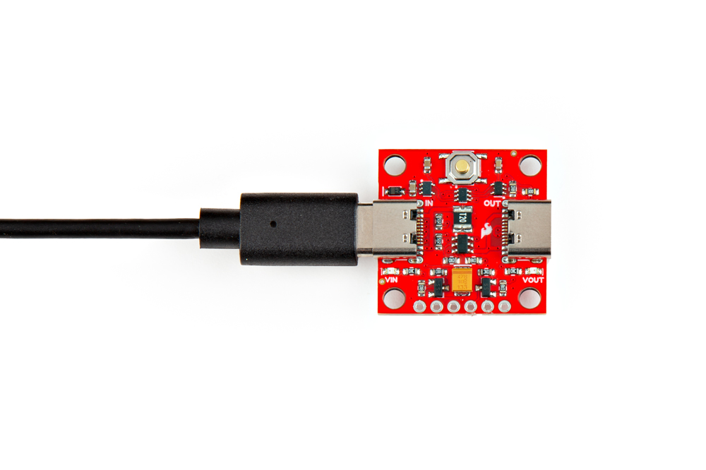
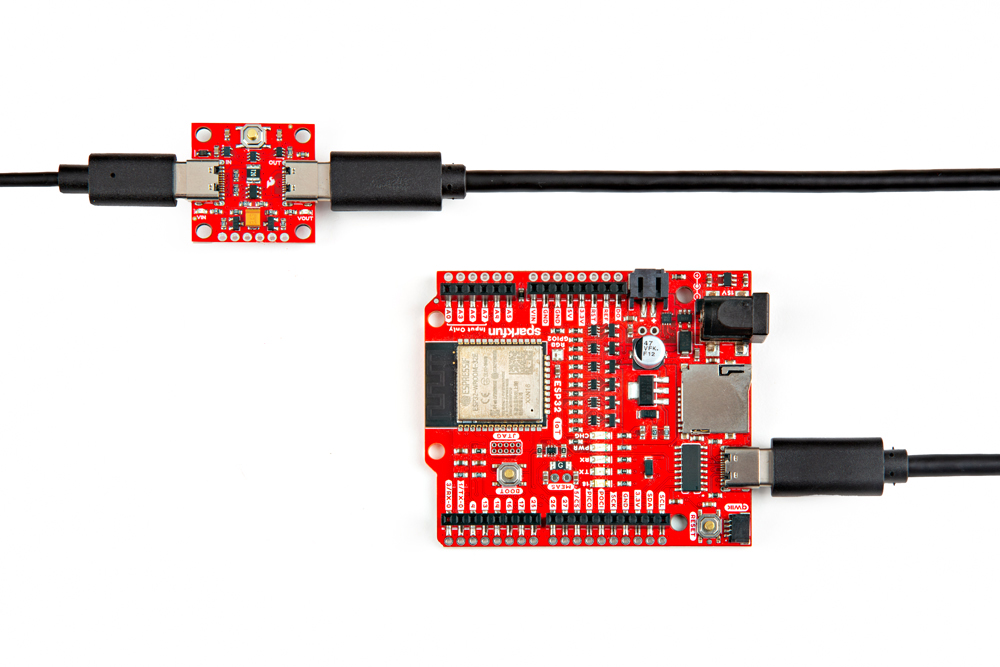
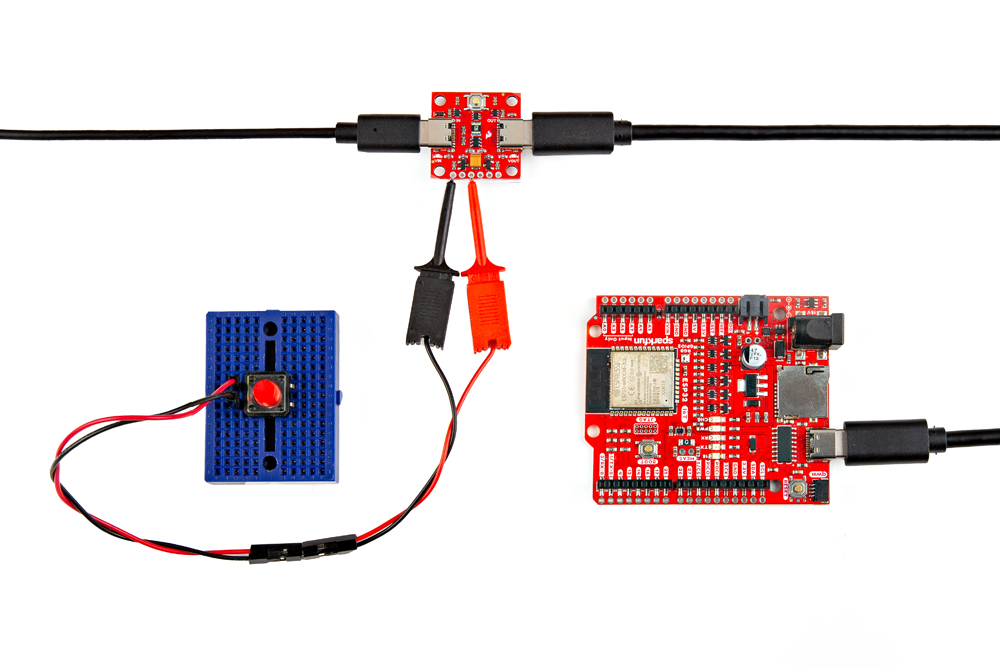
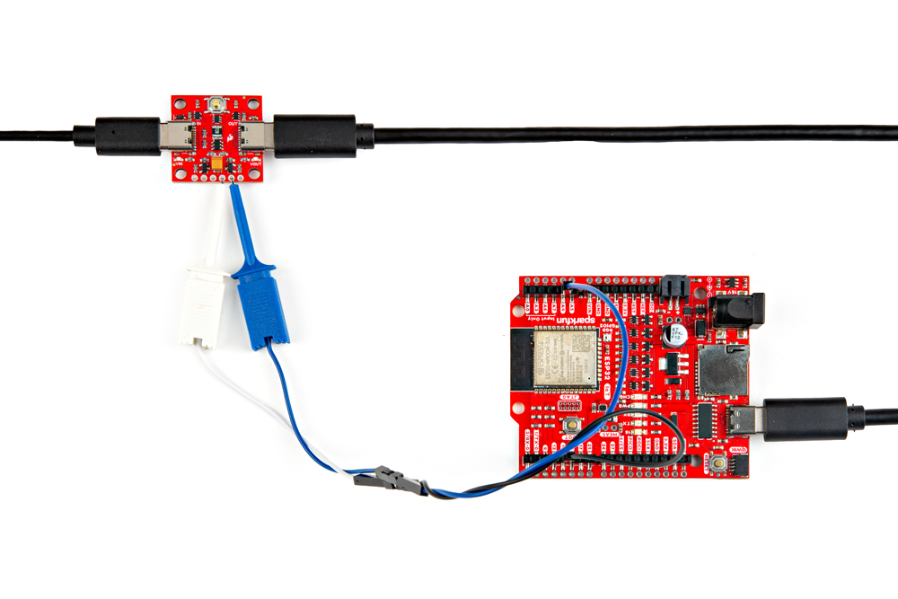
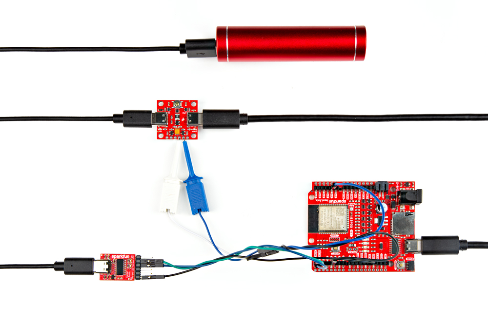

In this section, we will go over how to connect to the Soft Power Switch - USB-C.

### Connecting via PTH

For temporary connections to the PTHs, you could use IC hooks to test out the pins. However, you'll need to solder headers or wires of your choice to the board for a secure connection. You can choose between a combination of [header pins and jumper wires](https://learn.sparkfun.com/tutorials/how-to-solder-through-hole-soldering/all), or [stripping wire and soldering the wire](https://learn.sparkfun.com/tutorials/working-with-wire/all) directly to the board.

-   <a href="https://learn.sparkfun.com/tutorials/how-to-solder-through-hole-soldering/all">
      <figure markdown>
        
      </figure>
    </a>

    ---

    <a href="https://learn.sparkfun.com/tutorials/how-to-solder-through-hole-soldering/all">
      <b>How to Solder: Through Hole Soldering</b>
    </a>
<!-- ----------WHITE SPACE BETWEEN GRID CARDS---------- -->

-   <a href="https://learn.sparkfun.com/tutorials/working-with-wire/all">
      <figure markdown>
        
      </figure>
    </a>

    ---

    <a href="https://learn.sparkfun.com/tutorials/working-with-wire/all">
      <b>Working with Wire</b>
    </a>
<!-- ----------WHITE SPACE BETWEEN GRID CARDS---------- -->

### Input Power

The board was designed to be used with USB. Simply insert the USB-C connector into the USB connector labeled as IN.

  <table>
    <tr style="vertical-align:middle;">
     <td style="text-align: center; vertical-align: middle; border: solid 1px #cccccc;"></td>
    </tr>
    <tr style="vertical-align:middle;">
     <td style="text-align: center; vertical-align: middle; border: solid 1px #cccccc;"><i>USB-C Cable inserted into USB-C Connector</i></td>
    </tr>
  </table>

Of course, power can also be soldered directly to the PTH as well.

    <table>
        <tr>
            <th style="text-align: center; vertical-align: middle; border: solid 1px #cccccc;">Power Supply
            </th>
            <th style="text-align: center; vertical-align: middle; border: solid 1px #cccccc;">Soft Power Switch - USB-C
            </th>
        </tr>
        <tr>
            <td style="text-align: center; border: solid 1px #cccccc;" bgcolor="#f2dede">1.8V to 5.5V  Typically 5V  if using USB
            </td>
            <td style="text-align: center; border: solid 1px #cccccc;" bgcolor="#f2dede">VIN
            </td>
        </tr>
        <tr>
            <td style="text-align: center; border: solid 1px #cccccc;" bgcolor="#DDDDDD">GND
            </td>
            <td style="text-align: center; border: solid 1px #cccccc;" bgcolor="#DDDDDD">GND
            </td>
        </tr>
    </table>

### Output Power

Then you can insert it between the Soft Power Switch's USB connector labeled OUT and the other end will be inserted into the USB connector of the target board being powered (in this case, the SparkFun IoT RedBoard - ESP32 Development Board).

  <table>
    <tr style="vertical-align:middle;">
     <td style="text-align: center; vertical-align: middle; border: solid 1px #cccccc;"></td>
    </tr>
    <tr style="vertical-align:middle;">
     <td style="text-align: center; vertical-align: middle; border: solid 1px #cccccc;"><i>USB Cable between the Soft Power Switch - USB-C and IoT RedBoard - ESP32</i></td>
    </tr>
  </table>

Of course, power can also be soldered directly to the PTH as well. Since we are powering the output with a USB, you will need to connect it to your system's USB power. In this case, VUSB net was labeled as V on the board. Depending on your system, it may be labeled as VUSB, RAW, or VCC. Make sure to check the board's hardware design before deciding to connect VOUT to your system.

    <table>
        <tr>
            <th style="text-align: center; vertical-align: middle; border: solid 1px #cccccc;">Soft Power Switch - USB-C
            </th>
            <th style="text-align: center; vertical-align: middle; border: solid 1px #cccccc;">SparkFun IoT RedBoard - ESP32 Development Board
            </th>
        </tr>
        <tr>
            <td style="text-align: center; border: solid 1px #cccccc;" bgcolor="#f2dede">VOUT
            </td>
            <td style="text-align: center; border: solid 1px #cccccc;" bgcolor="#f2dede">5V (or V)
            </td>
        </tr>
        <tr>
            <td style="text-align: center; border: solid 1px #cccccc;" bgcolor="#DDDDDD">GND
            </td>
            <td style="text-align: center; border: solid 1px #cccccc;" bgcolor="#DDDDDD">-
            </td>
        </tr>
    </table>

!!! note
    The voltage range of the Soft Power Switch - USB-C is between 1.8V to 5.5V. Users can also connect a different power source and connect the output to VIN of their system. Just make that the voltage is within the operating range of the target device.

### External Button

For users that need to connect an external button, you will simply need to connect one terminal of the button to BTN and the other terminal to GND. In this case, IC hooks and F/M jumper wires were used to connect an external momentary push button.

  <table>
    <tr style="vertical-align:middle;">
     <td style="text-align: center; vertical-align: middle; border: solid 1px #cccccc;"></td>
    </tr>
    <tr style="vertical-align:middle;">
     <td style="text-align: center; vertical-align: middle; border: solid 1px #cccccc;"><i>External Button Connected</i></td>
    </tr>
  </table>

    <table>
        <tr>
            <th style="text-align: center; vertical-align: middle; border: solid 1px #cccccc;">Soft Power Switch - USB-C
            </th>
            <th style="text-align: center; vertical-align: middle; border: solid 1px #cccccc;">Button
            </th>
        </tr>
        <tr>
            <td style="text-align: center; border: solid 1px #cccccc;" bgcolor="#cce5ff">BTN
            </td>
            <td style="text-align: center; border: solid 1px #cccccc;" bgcolor="#cce5ff">Normally Open Pin
            </td>
        </tr>
        <tr>
        <td style="text-align: center; border: solid 1px #cccccc;" bgcolor="#DDDDDD">GND
        </td>
            <td style="text-align: center; border: solid 1px #cccccc;" bgcolor="#DDDDDD">Common Pin
            </td>
        </tr>
    </table>

### Off and Push

To connect to the OFF and PUSH pins with a microcontroller, you will need two GPIO pins with code to control or read the Soft Power Switch. Depending on your microcontroller, you may need to adjust the pin connections and definitions with respect to the microcontroller's GPIO pins.

  <table>
    <tr style="vertical-align:middle;">
     <td style="text-align: center; vertical-align: middle; border: solid 1px #cccccc;"></td>
    </tr>
    <tr style="vertical-align:middle;">
     <td style="text-align: center; vertical-align: middle; border: solid 1px #cccccc;"><i>OFF and PUSH Pins Connected to IoT RedBoard</i></td>
    </tr>
  </table>

    <table>
        <tr>
            <th style="text-align: center; vertical-align: middle; border: solid 1px #cccccc;">Soft Power Switch - USB-C
            </th>
            <th style="text-align: center; vertical-align: middle; border: solid 1px #cccccc;">SparkFun IoT RedBoard - ESP32 Development Board
            </th>
        </tr>
        <tr>
            <td style="text-align: center; border: solid 1px #cccccc;" bgcolor="#cce5ff">OFF
            </td>
            <td style="text-align: center; border: solid 1px #cccccc;" bgcolor="#cce5ff"><code>32</code> (or <code>A4</code>)
            </td>
        </tr>
        <tr>
            <td style="text-align: center; border: solid 1px #cccccc;" bgcolor="#d4edda">PUSH
            </td>
            <td style="text-align: center; border: solid 1px #cccccc;" bgcolor="#d4edda"><code>14</code>
            </td>
        </tr>
    </table>

!!! tip
    Remember, the PUSH pin requires a pull-up resistor when connecting it to a microcontroller's GPIO pin. You can use the [internal pull-up resistor](https://learn.sparkfun.com/tutorials/pull-up-resistors/all) on the microcontroller so that the pin is not floating.

### Arduino Serial Output

To view the Arduino's serial output when powering the system through USB battery, you will need to wire a 3.3V Serial Basic Breakout to the Arduino&apos;s serial UART. In this case, we connected to the SparkFun IoT RedBoard - ESP32 Development Board primary UART port. Depending on your microcontroller, you may need to adjust the pin connections and definitions with respect to the microcontroller's UART pins.

    <table>
        <tr>
            <th style="text-align: center; vertical-align: middle; border: solid 1px #cccccc;">3.3V Serial Basic
            </th>
            <th style="text-align: center; vertical-align: middle; border: solid 1px #cccccc;">SparkFun IoT RedBoard - ESP32 Development Board
            </th>
        </tr>
        <tr>
            <td style="text-align: center; border: solid 1px #cccccc;" bgcolor="#d4edda">TXO
            </td>
            <td style="text-align: center; border: solid 1px #cccccc;" bgcolor="#d4edda">3/RX-0
            </td>
        </tr>
        <tr>
            <td style="text-align: center; border: solid 1px #cccccc;" bgcolor="#ffdaaf">RXI
            </td>
            <td style="text-align: center; border: solid 1px #cccccc;" bgcolor="#ffdaaf">1/TX-0
            </td>
        </tr>
        <tr>
            <td style="text-align: center; border: solid 1px #cccccc;" bgcolor="#DDDDDD">GND
            </td>
            <td style="text-align: center; border: solid 1px #cccccc;" bgcolor="#DDDDDD">GND
            </td>
        </tr>
    </table>

  <table>
    <tr style="vertical-align:middle;">
     <td style="text-align: center; vertical-align: middle; border: solid 1px #cccccc;"></td>
    </tr>
    <tr style="vertical-align:middle;">
     <td style="text-align: center; vertical-align: middle; border: solid 1px #cccccc;"><i>3.3V Serial Basic Connected to ESP32 IoT RedBoard Hardware UART</i></td>
    </tr>
  </table>

