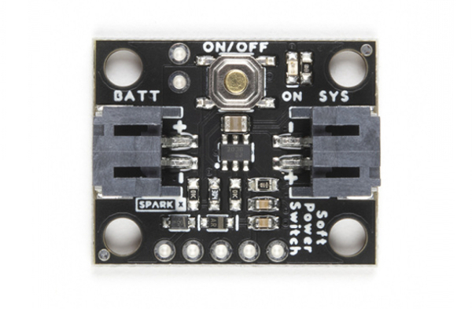
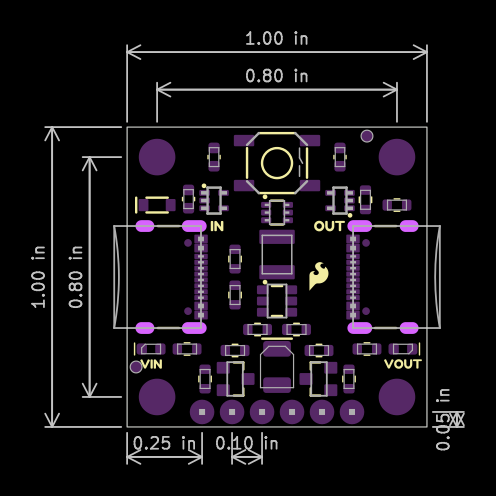

In this section, we will highlight the hardware and pins that are broken out on the SparkFun Soft Power Switch - USB-C. For more information, check out our [Resources and Going Further](../resources/) on the components used on the breakout board.

  <table>
    <tr style="vertical-align:middle;">
     <td style="text-align: center; vertical-align: middle; border: solid 1px #cccccc;"></td>
     <td style="text-align: center; vertical-align: middle; border: solid 1px #cccccc;"></td>
    </tr>
    <tr style="vertical-align:middle;">
     <td style="text-align: center; vertical-align: middle; border: solid 1px #cccccc;"><i>Top View</i></td>
     <td style="text-align: center; vertical-align: middle; border: solid 1px #cccccc;"><i>Bottom View</i></td>
    </tr>
  </table>

### Soft Power Switch Versions

The [SparkX Mk1 Soft Power Switch](https://www.sparkfun.com/products/17870) is great, but we do see occasional issues caused by component tolerances or the operating temperature. Mk2 is based on an application note by Texas Instruments, and is a completely digital design. It is based around a 74LVC1G175 D-type flip-flop - remember those?! - and is insensitive to temperature and component variation.

  <table>
    <tr style="vertical-align:middle;">
     <td style="text-align: center; vertical-align: middle; border: solid 1px #cccccc;"></td>
     <td style="text-align: center; vertical-align: middle; border: solid 1px #cccccc;"></td>
    </tr>
    <tr style="vertical-align:middle;">
     <td style="text-align: center; vertical-align: middle; border: solid 1px #cccccc;"><i>SparkX Soft Power Switch Mk1</i></td>
     <td style="text-align: center; vertical-align: middle; border: solid 1px #cccccc;"><i>SparkFun Soft Power Switch - USB-C</i></td>
    </tr>
  </table>

It also includes improvements like:

- An over-current self-resetting 2A fuse.
- Input and output LEDs.
- LED jumpers.
- Improved momentary button (i.e. the height of the button is increased).

Differences include:

- The Soft Power Switch - USB-C works up to 5.5V only (the Mk1 is good up to 12V).
- For Mk2, driving the fast OFF pin HIGH by the system will force fast power off via software. However for Mk1, the fast OFF pin was driven low.
- Slightly bigger PCB: 1.0"x1.0" sized breakout (the Mk1 was 0.8"x1.0").
- This version includes USB connectors instead of JST connectors.
- USB data lines between the IN and OUT ports.

### Power

!!! warning
    The Soft Power Switch - USB-C works up to 5.5V only. (Mk1 is good up to 12V.)

!!! warning
    The Soft Power Switch USB-C was designed to work with DC loads. Unfortunately, the board is not designed for AC loads.

!!! note
    Once the Soft Power Switch - USB-C is powered, it will take a few seconds to discharge power after disconnecting the power source from the IN port. So if you decide to do quick power cycle, the board can still be powered if there is not a long enough delay.

The maximum input voltage that the Soft Power Switch - USB-C can handle is **5.5V** while the minimum input voltage is _1.8V_. The board was designed to be used with USB, so the typical voltage will be about 5V. The maximum current draw that the board can handle is 2A continuous and 4A peak (fuse protected). With the VIN LED disabled, the board has a very low quiescent current: <1&micro;A @ 3.75V.

* **VIN** &mdash; This pin is the voltage input. As stated above, the maximum input voltage is 5.5V while the minimum is 1.8V. Voltage is applied to this pin from a USB power source, which is 5V.
* **VOUT** &mdash; The output voltage of the board whenever the switch is active.
* **GND** &mdash; Of course, is the common, ground voltage (0V reference) for the system.

  <table>
    <tr style="vertical-align:middle;">
     <td style="text-align: center; vertical-align: middle; border: solid 1px #cccccc;"></td>
     <td style="text-align: center; vertical-align: middle; border: solid 1px #cccccc;"></td>
    </tr>
    <tr style="vertical-align:middle;">
     <td style="text-align: center; vertical-align: middle; border: solid 1px #cccccc;" colspan="2"><i>Power, Ground and USB Connectors Highlighted</i></td>
    </tr>
  </table>

The Soft Power Switch - USB-C also supports USB data feed-through. If the target device is a microcontroller, you can send serial data and upload to the board.

### Power Button and Button State

The board includes a built-in momentary push button as the power button. This pin is broken out to a PTH for users to connect an external button. There is also the PUSH pin to indicate the button's state. The PUSH pin can act as an output to a microcontroller indicating the state of the power button (HIGH = not pressed, LOW = user is pressing power button). This can be used as an input to your firmware to begin to shut down before power is lost. Alternatively, there is also an OFF pin that can be driven HIGH by the system forcing fast power off via software. Below is a summary of the pins broken out.

* **BTN** &mdash; Short for button. If desired, connect this input pin to an external button between BTN and GND.
* **PUSH** &mdash; Open-drain output. This pin requires a pull-up resistor. A low indicates the button is pushed.
* **OFF** &mdash; Drive HIGH to turn the output off.

  <table>
    <tr style="vertical-align:middle;">
     <td style="text-align: center; vertical-align: middle; border: solid 1px #cccccc;"></td>
     <td style="text-align: center; vertical-align: middle; border: solid 1px #cccccc;"></td>
    </tr>
    <tr style="vertical-align:middle;">
     <td style="text-align: center; vertical-align: middle; border: solid 1px #cccccc;"><i>Top View</i></td>
     <td style="text-align: center; vertical-align: middle; border: solid 1px #cccccc;"><i>Bottom View</i></td>
    </tr>
  </table>

!!! note
    For Mk2, driving the fast OFF pin HIGH by the system will force fast power off via software. However for Mk1, the fast OFF pin was driven low.

### LEDs

* **VIN** &mdash; The VIN LED connects to the input voltage. This indicates when there is voltage at VIN. This LED can be disabled with the LED jumper on the back of the board and below the silkscreen labeled IN.
* **VOUT** &mdash; The VOUT LED connects to the output voltage. This indicates when there is voltage at VOUT. This LED can be disabled with the LED jumper on the back of the board and below the silkscreen labeled OUT.

  <table>
    <tr style="vertical-align:middle;">
     <td style="text-align: center; vertical-align: middle; border: solid 1px #cccccc;"></td>
    </tr>
    <tr style="vertical-align:middle;">
     <td style="text-align: center; vertical-align: middle; border: solid 1px #cccccc;"><i>LEDs Highlighted</i></td>
    </tr>
  </table>

### Jumpers

!!!note
    If this is your first time working with jumpers, check out the [How to Work with Jumper Pads and PCB Traces](https://learn.sparkfun.com/tutorials/how-to-work-with-jumper-pads-and-pcb-traces/all) tutorial for more information.

The back of the board includes jumpers to configure the board.

* **LED** (below IN) &mdash; By default, the LED jumper located below the silkscreen labeled IN is closed. This connects the VIN LED to the input voltage. Cutting this will disable the LED for the input voltage.
* **LED** (below OUT) &mdash; By default, the LED jumper located below the silkscreen labeled OUT is closed. This connects the LED to the output voltage. Cutting this jumper will disable the LED for the output voltage.

  <table>
    <tr style="vertical-align:middle;">
     <td style="text-align: center; vertical-align: middle; border: solid 1px #cccccc;"></td>
    </tr>
    <tr style="vertical-align:middle;">
     <td style="text-align: center; vertical-align: middle; border: solid 1px #cccccc;"><i>Jumpers Highlighted</i></td>
    </tr>
  </table>

### Board Dimensions

The board is 1.0" x 1.0" (2.54mm x 2.54mm). There are 4x mounting holes by the corners of the board. You can use 4-40 standoffs to mount the board to a panel or enclosure.

  <table>
    <tr style="vertical-align:middle;">
     <td style="text-align: center; vertical-align: middle; border: solid 1px #cccccc;"></td>
    </tr>
    <tr style="vertical-align:middle;">
     <td style="text-align: center; vertical-align: middle; border: solid 1px #cccccc;"><i>Board Dimensions</i></td>
    </tr>
  </table>

